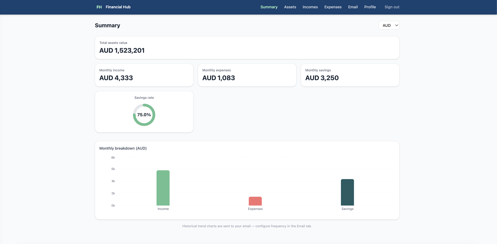
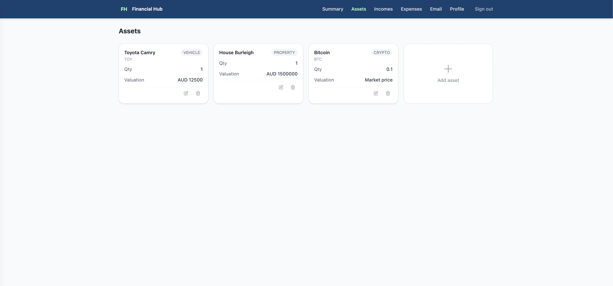
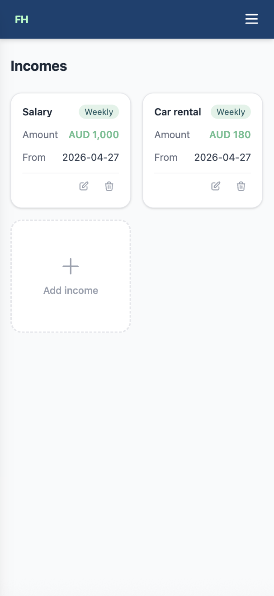
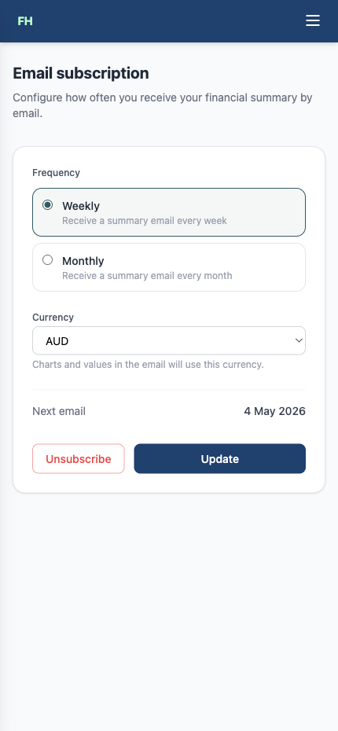

# Financial Hub — Frontend 💸


Mobile-first React SPA for managing a personal financial portfolio. Lets users track assets, incomes and expenses, visualise their monthly summary with charts, and configure automated email reports.

This service is part of a larger financial portfolio system:
- ☕ **[Financial Profile API](https://github.com/emiisomoza/financial-profile-api)** — Java/Spring Boot: manages users, income, expenses and assets
- 💱 **[financial-price-api](https://github.com/emiisomoza/financial-price-api)** — Ruby/Sinatra: resolves real-time asset prices
- 🐍 **[financial-summary-worker](https://github.com/emiisomoza/financial-summary-worker)** — Python: consumes a queue and sends summary emails
- ⚛️ **Financial Hub Frontend** (this repo) — React/TypeScript: web interface for the platform

---

## Screenshots

### Summary


### Assets


### Incomes & Expenses


### Email subscription


---

## Features

- **Dashboard** — KPI cards (total assets, monthly income, expenses, savings) + savings rate ring + bar chart, with currency selector (AUD, USD, EUR, GBP, JPY)
- **Assets** — full CRUD with market-price or manual valuation; real-time prices fetched by the Ruby Price API
- **Incomes & Expenses** — full CRUD with frequency (weekly, fortnightly, monthly, yearly, one-time) and category tagging
- **Email subscription** — configure weekly or monthly summary emails in the preferred currency
- **Profile** — update personal info and change password
- **Auth** — JWT-based login and registration; token stored in `localStorage`; auto-redirect to login on expiry

---

## Tech Stack

| | |
|---|---|
| Language | TypeScript 5 |
| Framework | React 18 |
| Build tool | Vite |
| Styling | Tailwind CSS v4 |
| Routing | React Router v6 |
| HTTP client | Axios |
| Charts | Recharts |
| CI | GitHub Actions |

---

## Pages

| Path | Page | Auth |
|------|------|------|
| `/login` | Login & Register | Public |
| `/summary` | Financial summary dashboard | Protected |
| `/assets` | Asset management | Protected |
| `/incomes` | Income management | Protected |
| `/expenses` | Expense management | Protected |
| `/subscription` | Email subscription config | Protected |
| `/profile` | User profile & password | Protected |
| `/` | Redirects to `/summary` | Protected |

---

## Run locally

### Prerequisites
- Node.js 20+
- The [Financial Profile API](https://github.com/emiisomoza/financial-profile-api) running at `http://localhost:8080`

### Setup
```bash
git clone https://github.com/emiisomoza/financial-hub-frontend.git
cd financial-hub-frontend
npm install
```

### Start the dev server
```bash
npm run dev
```

App available at `http://localhost:5173`

### Build for production
```bash
npm run build
```

---

## Project structure

```
financial-hub-frontend/
├── .github/
│   └── workflows/
│       └── ci.yml               # GitHub Actions CI (type-check + build)
├── public/
│   └── logo.svg                 # FH monogram logo
├── src/
│   ├── api/
│   │   ├── client.ts            # Axios instance with JWT interceptor + 401 redirect
│   │   ├── auth.ts
│   │   ├── assets.ts
│   │   ├── incomes.ts
│   │   ├── expenses.ts
│   │   ├── summary.ts
│   │   ├── subscriptions.ts
│   │   └── users.ts
│   ├── types/
│   │   └── api.ts               # TypeScript interfaces mirroring all Java API DTOs
│   ├── context/
│   │   └── AuthContext.tsx      # JWT storage, login/logout, userId from token
│   ├── hooks/
│   │   ├── useAuth.ts
│   │   ├── useAssets.ts
│   │   ├── useIncomes.ts
│   │   ├── useExpenses.ts
│   │   └── useSummary.ts
│   ├── components/
│   │   ├── layout/
│   │   │   ├── AppLayout.tsx
│   │   │   ├── Navbar.tsx       # Sticky nav with mobile hamburger drawer
│   │   │   └── ProtectedRoute.tsx
│   │   └── ui/
│   │       └── Modal.tsx
│   ├── pages/
│   │   ├── LoginPage.tsx
│   │   ├── AssetsPage.tsx
│   │   ├── IncomesPage.tsx
│   │   ├── ExpensesPage.tsx
│   │   ├── SummaryPage.tsx
│   │   ├── SubscriptionPage.tsx
│   │   └── ProfilePage.tsx
│   ├── App.tsx
│   ├── main.tsx
│   └── index.css                # Tailwind v4 @theme custom color palette
└── vite.config.ts
```

---

## License

MIT
